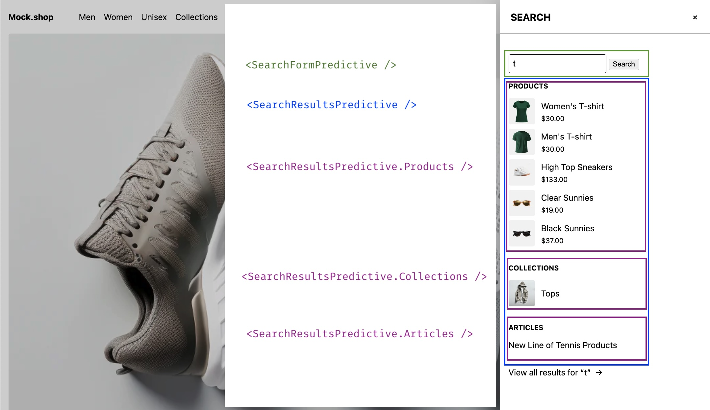

# Hydrogen Predictive Search

Our skeleton template ships with predictive search functionality. While [regular search](../search/search.md)
provides paginated search of `pages`, `articles` and `products` inside the `/search` route,
predictive provides real-time results in a aside drawer for `pages`, `articles`, `products`, `collections` and
recommended `queries/suggestions`.

This integration uses the storefront API (SFAPI) [predictiveSearch](https://shopify.dev/docs/api/storefront/latest/queries/vpredictiveSearch) endpoint to retrieve predictive search results based on a search term.

## Components Architecture



## Components

| File                                                                                             | Description                                                                                                                                            |
| ------------------------------------------------------------------------------------------------ | ------------------------------------------------------------------------------------------------------------------------------------------------------ |
| [`app/components/SearchFormPredictive.tsx`](../../app/components/SearchFormPredictive.tsx)       | A fully customizable form component configured to make form `GET` requests to the `/search` route.                                                    |
| [`app/components/SearchResultsPredictive.tsx`](../../app/components/SearchResultsPredictive.tsx) | A fully customizable search results wrapper, that provides compound components to render `articles`, `pages`, `products`, `collections` and `queries`. |

## Instructions

### 1. Create the search route

Create a new file at `/routes/search.tsx` (if not already created)

### 3. Add `predictiveSearch` query and fetcher

The predictiveSearch fetcher parses the `q` and `limit` formData properties sent
by the `<SearchFormPredictive />` component and performs the predictive search
SFAPI request.

```ts
/**
 * Predictive search query and fragments
 * (adjust as needed)
 */
const PREDICTIVE_SEARCH_ARTICLE_FRAGMENT = `#graphql
  fragment PredictiveArticle on Article {
    __typename
    id
    title
    handle
    blog {
      handle
    }
    image {
      url
      altText
      width
      height
    }
    trackingParameters
  }
` as const;

const PREDICTIVE_SEARCH_COLLECTION_FRAGMENT = `#graphql
  fragment PredictiveCollection on Collection {
    __typename
    id
    title
    handle
    image {
      url
      altText
      width
      height
    }
    trackingParameters
  }
` as const;

const PREDICTIVE_SEARCH_PAGE_FRAGMENT = `#graphql
  fragment PredictivePage on Page {
    __typename
    id
    title
    handle
    trackingParameters
  }
` as const;

const PREDICTIVE_SEARCH_PRODUCT_FRAGMENT = `#graphql
  fragment PredictiveProduct on Product {
    __typename
    id
    title
    handle
    trackingParameters
    selectedOrFirstAvailableVariant(
      selectedOptions: []
      ignoreUnknownOptions: true
      caseInsensitiveMatch: true
    ) {
      id
      image {
        url
        altText
        width
        height
      }
      price {
        amount
        currencyCode
      }
    }
  }
` as const;

const PREDICTIVE_SEARCH_QUERY_FRAGMENT = `#graphql
  fragment PredictiveQuery on SearchQuerySuggestion {
    __typename
    text
    styledText
    trackingParameters
  }
` as const;

// NOTE: https://shopify.dev/docs/api/storefront/latest/queries/predictiveSearch
const PREDICTIVE_SEARCH_QUERY = `#graphql
  query predictiveSearch(
    $country: CountryCode
    $language: LanguageCode
    $limit: Int!
    $limitScope: PredictiveSearchLimitScope!
    $term: String!
    $types: [PredictiveSearchType!]
  ) @inContext(country: $country, language: $language) {
    predictiveSearch(
      limit: $limit,
      limitScope: $limitScope,
      query: $term,
      types: $types,
    ) {
      articles {
        ...PredictiveArticle
      }
      collections {
        ...PredictiveCollection
      }
      pages {
        ...PredictivePage
      }
      products {
        ...PredictiveProduct
      }
      queries {
        ...PredictiveQuery
      }
    }
  }
  ${PREDICTIVE_SEARCH_ARTICLE_FRAGMENT}
  ${PREDICTIVE_SEARCH_COLLECTION_FRAGMENT}
  ${PREDICTIVE_SEARCH_PAGE_FRAGMENT}
  ${PREDICTIVE_SEARCH_PRODUCT_FRAGMENT}
  ${PREDICTIVE_SEARCH_QUERY_FRAGMENT}
` as const;

/**
 * Predictive search fetcher
 */
async function predictiveSearch({
  request,
  context,
}: Pick<ActionFunctionArgs, 'request' | 'context'>) {
  const {storefront} = context;
  const formData = await request.formData();
  const term = String(formData.get('q') || '');

  const limit = Number(formData.get('limit') || 10);

  // Predictively search articles, collections, pages, products, and queries (suggestions)
  const {predictiveSearch: items, errors} = await storefront.query(
    PREDICTIVE_SEARCH_QUERY,
    {
      variables: {
        // customize search options as needed
        limit,
        limitScope: 'EACH',
        term,
      },
    },
  );

  if (errors) {
    throw new Error(
      `Shopify API errors: ${errors.map(({message}) => message).join(', ')}`,
    );
  }

  if (!items) {
    throw new Error('No predictive search data returned');
  }

  const total = Object.values(items).reduce((acc, {length}) => acc + length, 0);

  return {term, result: {items, total}, error: null};
}

